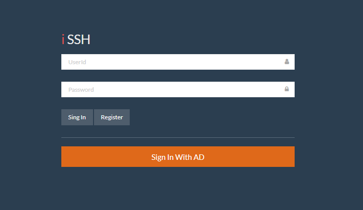
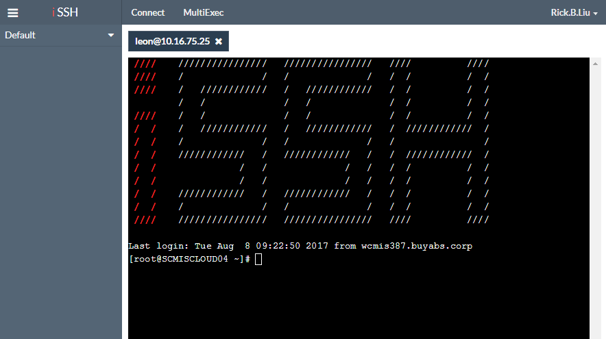
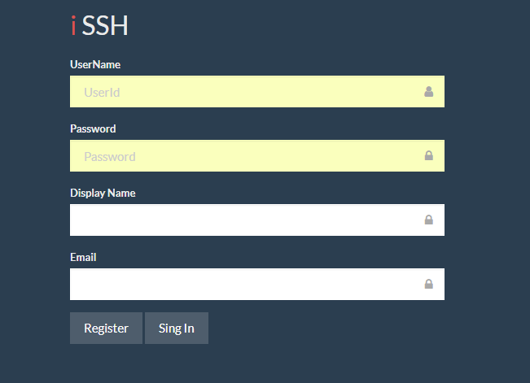
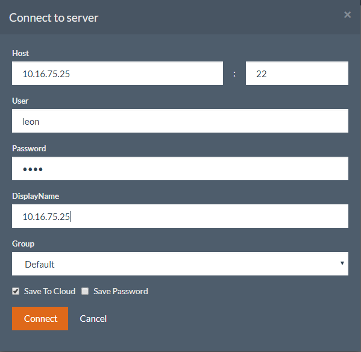
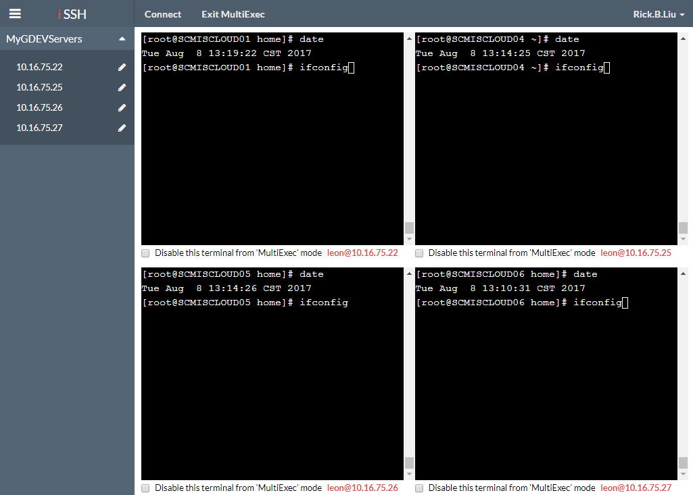

# i-SSH 

一个提供 ssh 命令行输入的 web 应用程序.     

## 功能特点

* web ssh
* 服务器信息管理
* 多机器同步输入

## 页面预览

> 登录界面   

   

> 服务器操作页面   

   

## 账户注册

> 用户初次使用可选择 `个人账户` 或 `域账户` 登录，若没有 `个人账户`，需在主页面点击 `Register` 按钮进行账户注册。      

      

- `UserName`: 新注册账户名称      
- `Password`: 账户密码   
- `Display Name`: 登录后显示名称   
- `Email`: 账户邮件地址   

## 连接服务器

> 登录成功后，在顶部菜单点击 `Connect` 开始创建一个到服务器的新连接。

   

> 创建连接，信息填写完毕后点击 `Connect` 按钮

  

- `Host`: 服务器`IP`地址或主机名称，默认端口：22      
- `User`: ssh 账户   
- `Password`: ssh 密码   
- `DisplayName`: 服务器显示名称，可任意输入加以区分
- `Group`: 待连接服务器隶属分组，默认分组：`Default`；点击下拉中的 `New Group` 项，可新建分组 
- `Save To Cloud`: 是否将本次连接信息保存到云；保存（默认），则服务器信息会自动添加到左侧分组列表中；不保存，则为一次临时连接 
- `Save Password`: 保存 `ssh` 密码功能

## 多路同步输入模式

> 当已连接多台服务器时，可在顶部菜单点击 `MultiExec` 进入多路分屏同步输入模式。

> 点击 `MultiExec` 后，当前布局立即切换为分屏模式，此时在任意一个子窗口输入命令，其余窗口会同步输入。   

> 每一路下方的 `Disable this terminal from 'MultiExec' mode` 选项用于关闭同步输入功能。

> 点击 `Exit MultiExec`，退出多路同步输入模式，还原为多 `Tab` 页布局。

   

